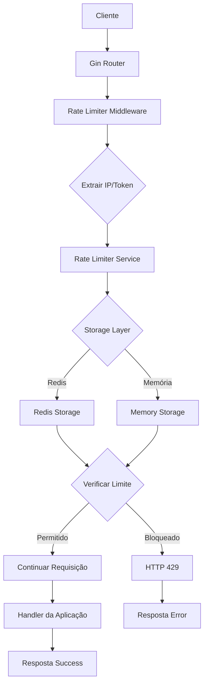

# 🚀 Rate Limiter - Sistema Avançado de Controle de Tráfego

[](https://golang.org/)
[]()
[]()
[]()

Um **middleware de rate limiter** robusto e escalável desenvolvido em Go para controlar o tráfego de requisições em serviços web. Oferece limitação inteligente por IP e token de acesso, com múltiplas estratégias de armazenamento e observabilidade completa.

## 🎯 **Características Principais**

### ✅ **Desafio_Rate_Limiter**
- ✅ Middleware injetável para servidor web
- ✅ Configuração flexível de limites por segundo  
- ✅ Bloqueio temporal configurable para IPs/tokens
- ✅ Configuração via variáveis de ambiente e `.env`
- ✅ Limitação simultânea por IP e token com prioridade
- ✅ Resposta HTTP 429 com mensagem específica
- ✅ Armazenamento Redis com fallback para memória
- ✅ Strategy Pattern para múltiplos storages
- ✅ Lógica de rate limiting completamente separada

### 🚀 **Funcionalidades Avançadas**
- **Clean Architecture** com camadas bem definidas
- **Observabilidade completa** com logs estruturados e métricas
- **Alta performance** com operações concorrentes thread-safe  
- **Escalabilidade horizontal** via Redis distribuído
- **API de gerenciamento** para status e reset de limites
- **Graceful shutdown** e health checks
- **Testes abrangentes** (unitários, integração, E2E)

## 📋 **Requisitos**

- **Go 1.21+**
- **Redis 6.0+** (opcional, fallback para memória)
- **Docker & Docker Compose** (para desenvolvimento)

## 🚀 **Quick Start**

### 1. **Clone o Repositório**
```bash
git clone <repository-url>
cd rate-limiter
```

### 2. **Configure o Ambiente**
```bash
# Copie o arquivo de exemplo
cp .env.example .env

# Configure as variáveis (opcional, tem defaults sensatos)
nano .env
```

### 3. **Inicie o Redis (Opcional)**
```bash
# Com Docker Compose
docker-compose up -d redis

# Ou use fallback para memória (automático se Redis falhar)
```

### 4. **Execute a Aplicação**
```bash
# Instale dependências
go mod tidy

# Execute o servidor
go run cmd/api/main.go
```

### 5. **Teste os Endpoints**
```bash
# Health check
curl http://localhost:8080/health

# Endpoint principal (rate limited)
curl http://localhost:8080/

# Com token
curl -H "X-Api-Token: premium_token_123" http://localhost:8080/

# Métricas do sistema
curl http://localhost:8080/metrics
```

## ⚙️ **Configuração**

### **Variáveis de Ambiente (.env)**
```bash
# Servidor
SERVER_PORT=8080
GIN_MODE=debug

# Rate Limiting  
DEFAULT_IP_LIMIT=10        # Requisições por minuto por IP
DEFAULT_TOKEN_LIMIT=100    # Requisições por minuto por token
RATE_WINDOW=60            # Janela de tempo em segundos
BLOCK_DURATION=180        # Tempo de bloqueio em segundos

# Redis (opcional)
REDIS_HOST=localhost
REDIS_PORT=6379
REDIS_PASSWORD=
REDIS_DB=0

# Logging
LOG_LEVEL=info            # debug, info, warn, error
LOG_FORMAT=json           # json, text

# Tokens
TOKEN_CONFIG_FILE=internal/config/tokens.json
```

### **Configuração de Tokens (tokens.json)**
```json
{
  "tokens": {
    "premium_token_123": {
      "token": "premium_token_123",
      "limit": 1000,
      "description": "Premium API access"
    },
    "basic_token_456": {
      "token": "basic_token_456", 
      "limit": 100,
      "description": "Basic API access"
    }
  }
}
```

## 🔧 **API Reference**

### **Endpoints Principais**

| Método | Endpoint | Descrição | Rate Limited |
|--------|----------|-----------|--------------|
| `GET` | `/` | Endpoint principal de exemplo | ✅ Sim |
| `GET` | `/health` | Health check do serviço | ❌ Não |
| `GET` | `/metrics` | Métricas de sistema | ❌ Não |

### **Endpoints Administrativos**

| Método | Endpoint | Descrição | Rate Limited |
|--------|----------|-----------|--------------|
| `GET` | `/admin/status` | Status de rate limits | ❌ Não |
| `POST` | `/admin/reset` | Reset de contadores | ❌ Não |

### **Headers de Resposta Rate Limiting**
```http
X-RateLimit-Limit: 10          # Limite configurado
X-RateLimit-Remaining: 7       # Requisições restantes  
X-RateLimit-Reset: 1640000000  # Timestamp do reset
X-RateLimit-Type: ip           # Tipo: "ip" ou "token"
Retry-After: 60                # Segundos para tentar novamente (em 429)
```

### **Exemplos de Uso**

#### **1. Consultar Status de IP**
```bash
curl "http://localhost:8080/admin/status?key=192.168.1.100&type=ip"
```

**Resposta:**
```json
{
  "key": "192.168.1.100",
  "limiter_type": "ip",
  "limit": 10,
  "current": 3,
  "remaining": 7,
  "reset_time": "2025-01-01T15:30:00Z",
  "blocked": false
}
```

#### **2. Reset de Contador**
```bash
curl -X POST http://localhost:8080/admin/reset \
  -H "Content-Type: application/json" \
  -d '{"key": "192.168.1.100", "type": "ip"}'
```

**Resposta:**
```json
{
  "status": "success",
  "message": "Rate limit reset successfully",
  "key": "192.168.1.100",
  "type": "ip"
}
```

#### **3. Resposta de Rate Limit Excedido (429)**
```json
{
  "error": "rate_limit_exceeded",
  "message": "you have reached the maximum number of requests or actions allowed within a certain time frame",
  "limit": 10,
  "window": 60,
  "retry_after": 45
}
```

## 🧪 **Testes**

### **Executar Todos os Testes**
```bash
# Todos os testes
go test ./... -v

# Com coverage
go test ./... -cover

# Testes específicos
go test ./internal/service/... -v
go test ./tests/e2e/... -v
```

### **Testes de Carga**
```bash
# Exemplo com Apache Bench
ab -n 1000 -c 10 http://localhost:8080/

# Exemplo com curl em loop
for i in {1..20}; do
  curl http://localhost:8080/ &
done
wait
```

## 🏗️ **Arquitetura**

### **Estrutura do Projeto**
```
rate-limiter/
├── cmd/api/                 # Aplicação principal
│   └── main.go
├── internal/               # Código interno
│   ├── domain/            # Entidades e interfaces
│   ├── config/            # Configurações
│   ├── logger/            # Sistema de logging
│   ├── storage/           # Camada de persistência
│   ├── service/           # Lógica de negócio
│   ├── middleware/        # Middleware Gin
│   └── handler/           # Handlers HTTP
├── tests/                 # Testes E2E
├── step-by-step/         # Documentação do desenvolvimento
├── docker-compose.yml    # Redis para desenvolvimento
├── .env.example         # Configurações de exemplo
└── README.md           # Esta documentação
```

### **Fluxo de Requisição**


## 📊 **Observabilidade**

### **Logs Estruturados**
```json
{
  "timestamp": "2025-01-01T15:30:00.000Z",
  "level": "info",
  "message": "Request allowed by rate limiter",
  "component": "rate_limiter",
  "client_ip": "192.168.1.100",
  "api_token": "premium***",
  "limiter_type": "token",
  "limit": 1000,
  "remaining": 995,
  "request_id": "req-123"
}
```

### **Métricas de Sistema**
- **Uptime** do serviço
- **Uso de memória** detalhado
- **Goroutines ativas**
- **Estatísticas GC**
- **Contadores de rate limiting**

## 🚀 **Deployment**

### **Docker**
```dockerfile
FROM golang:1.21-alpine AS builder
WORKDIR /app
COPY . .
RUN go mod download
RUN go build -o rate-limiter cmd/api/main.go

FROM alpine:latest
RUN apk --no-cache add ca-certificates
WORKDIR /root/
COPY --from=builder /app/rate-limiter .
COPY --from=builder /app/.env .
COPY --from=builder /app/internal/config/tokens.json ./internal/config/
CMD ["./rate-limiter"]
```

### **Kubernetes**
```yaml
apiVersion: apps/v1
kind: Deployment
metadata:
  name: rate-limiter
spec:
  replicas: 3
  selector:
    matchLabels:
      app: rate-limiter
  template:
    metadata:
      labels:
        app: rate-limiter
    spec:
      containers:
      - name: rate-limiter
        image: rate-limiter:latest
        ports:
        - containerPort: 8080
        env:
        - name: REDIS_HOST
          value: "redis-service"
        - name: SERVER_PORT
          value: "8080"
```

## 🔒 **Segurança**

- **Rate limiting** previne ataques DDoS
- **Token masking** em logs (primeiros 8 chars + ***)
- **IP validation** e sanitização
- **Graceful shutdown** evita corrupção de dados
- **Error handling** robusto sem vazamento de informações


## 📄 **Licença**

Este projeto está sob a licença MIT. Veja [LICENSE](LICENSE) para mais detalhes.

